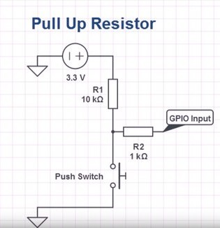

## Hệ thống nhúng

### Bài 1:

Nạp chương trình vào trong kit stm32f103c8t6 bằng phần mềm keilC.

### Bài 2:
- Yêu cầu 1: Thực hiện nhấp nháy led với chu kỳ 1000ms:
    + Tạo hàm delay sử dụng TIM2 của stm.
    + Cấu hình GPIO_Pin_13 của GPIOC ở chế độ output push pull dùng làm chân điều khiển led.
    + Hàm GPIO_SetBits và GPIO_ResetBits dùng để thay đổi trạng thái chân GPIO_Pin_13. 

- Yêu cầu 2: Sử dụng nút nhấn để điều khiển led.
    + Nối nút nhấn với kit stm32f103c8t6 theo kiểu pull up và cấu hình cho chân GPIO của nút nhấn.
    
    + Sử dụng GPIO_Pin_13 của GPIOC để làm led được điều khiển.