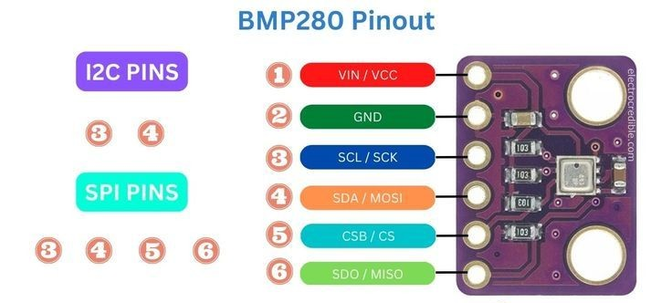

## Hệ thống nhúng

### Bài 1:

Nạp chương trình vào trong kit stm32f103c8t6 bằng phần mềm keilC.

### Bài 2:
- Yêu cầu 1: Thực hiện nhấp nháy led với chu kỳ 1000ms:
    + Tạo hàm delay sử dụng TIM2 của stm.
    + Cấu hình GPIO_Pin_13 của GPIOC ở chế độ output push pull dùng làm chân điều khiển led.
    + Hàm GPIO_SetBits và GPIO_ResetBits dùng để thay đổi trạng thái chân GPIO_Pin_13. 

- Yêu cầu 2: Sử dụng nút nhấn để điều khiển led.
    + Nối nút nhấn với kit stm32f103c8t6 theo kiểu pull up và cấu hình cho chân GPIO của nút nhấn.
    
    + Sử dụng GPIO_Pin_13 của GPIOC để làm led được điều khiển.

### Bài 3:

Ứng dụng Ngắt ngoài (External Interrupt) và Timer để điều khiển LED:

- Ngắt ngoài (EXTI):
    + Cấu hình GPIO_Pin_5 của GPIOA ở chế độ input pull-up để kết nối với nút nhấn.
    + Cấu hình ngắt ngoài EXTI5 với chế độ kích hoạt ngắt khi có cạnh xuống (Falling edge).
    + Cấu hình NVIC để xử lý ngắt ngoài EXTI9_5_IRQn với ưu tiên cao nhất.
    + Khi nút nhấn được kích hoạt, trạng thái LED PC13 sẽ được đảo ngược (toggle).

- Timer (TIM2):
    + Cấu hình Timer2 với tần số 10kHz (72MHz/7200), chu kỳ 10000 tick (tạo ngắt mỗi 1 giây).
    + Kích hoạt ngắt Update của Timer2 và cấu hình NVIC với mức ưu tiên thấp hơn ngắt ngoài.
    + Khi Timer2 đếm đủ chu kỳ, LED PA1 sẽ tự động đảo trạng thái (toggle).

- Chức năng:
    + LED PC13 được điều khiển thông qua nút nhấn kết nối với PA5.
    + LED PA1 tự động nhấp nháy với tần số 0.5Hz (chu kỳ 2 giây).

### Bài 4:

Ứng dụng Timer để điều khiển LED nhấp nháy:

- Cấu hình GPIO:
    + Cấu hình GPIO_Pin_13 của GPIOC ở chế độ output push-pull để điều khiển LED.
    + Ban đầu LED được tắt (GPIO_SetBits).

- Timer (TIM2):
    + Cấu hình Timer2 với tần số 10kHz (72MHz/7200), chu kỳ 5000 tick (tạo ngắt mỗi 0.5 giây).
    + Kích hoạt ngắt Update của Timer2 và cấu hình NVIC.
    + Khi Timer2 đếm đủ chu kỳ, LED PC13 sẽ tự động đảo trạng thái (toggle).

- Chức năng:
    + LED PC13 tự động nhấp nháy với tần số 1Hz (chu kỳ 1 giây).

### Bài 5:

Giao tiếp UART với STM32F103C8T6:

- **Cấu hình UART1:** 
  + Cấu hình GPIO với PA9 (TX) ở chế độ AF_PP và PA10 (RX) ở chế độ IN_FLOATING
  + Cấu hình USART1 với tốc độ baud 115200, 8 bit dữ liệu, 1 bit stop, không parity
  + Kích hoạt ngắt USART1 (RXNE) để nhận dữ liệu từ máy tính
  + Sử dụng NVIC để quản lý ngắt với mức ưu tiên cao
  
- **Cấu hình Timer:**
  + Sử dụng TIM2 với prescaler 72 (tạo xung clock 1MHz) để tạo hàm delay chính xác
  
- **Chức năng chính:**
  + Gửi chuỗi "Hello from STM32!" định kỳ qua UART mỗi giây
  + Nhận dữ liệu từ máy tính qua ngắt UART
  + Hỗ trợ đọc và xử lý buffer dữ liệu nhận được
  + Hiển thị dữ liệu qua terminal serial trên máy tính

### Bài 6:
Sơ đồ cảm biến BMP280

Datasheet của BMP280: [datasheet](doc/bst-bmp280-ds001.pdf)
Đọc cảm biến BMP280 qua giao tiếp I2C1 (PB6: SCL, PB7: SDA):

- **Cấu hình I2C1:**
  + Cấu hình GPIO với PB6 (SCL) và PB7 (SDA) ở chế độ AF_OD (Alternate Function Open Drain)
  + Cấu hình I2C1 ở chế độ chuẩn với tốc độ 100kHz, địa chỉ slave 0x00, hỗ trợ 7-bit address
  + Kích hoạt chức năng acknowledge

- **Cấu hình UART:**
  + Cấu hình USART1 với tốc độ baud 115200 để hiển thị kết quả
  
- **Giao tiếp với BMP280:**
  + Quét địa chỉ I2C để tìm thiết bị (phát hiện BMP280 ở địa chỉ 0x76)
  + Đọc ID của thiết bị để xác nhận là BMP280 (ID = 0x58)
  + Đọc các hệ số hiệu chuẩn từ thanh ghi nội (dig_T1, dig_T2, dig_T3)
  + Cấu hình chế độ đo với oversampling nhiệt độ x1 và mode normal
  
- **Xử lý dữ liệu:**
  + Đọc dữ liệu nhiệt độ thô từ thanh ghi 0xFA, 0xFB, 0xFC
  + Tính toán nhiệt độ thực tế sử dụng công thức của nhà sản xuất và các hệ số hiệu chuẩn
  + Hiển thị kết quả nhiệt độ lên UART mỗi giây

### Bài 7:

Đọc cảm biến BMP280 qua giao tiếp SPI:

- **Cấu hình SPI1:**
  + Cấu hình GPIO với PA5 (SCK), PA6 (MISO), PA7 (MOSI) ở chế độ AF_PP (Alternate Function Push-Pull)
  + Cấu hình PA4 làm chân CS (Chip Select) ở chế độ Out_PP
  + Cấu hình SPI1 ở chế độ master, tốc độ prescaler 32, CPOL=Low, CPHA=1Edge
  + Truyền dữ liệu 8-bit, MSB first

- **Cấu hình UART:**
  + Cấu hình USART1 với tốc độ baud 115200 để hiển thị kết quả

- **Giao tiếp với BMP280 qua SPI:**
  + Điều khiển chân CS để chọn thiết bị (Low khi truyền, High khi nghỉ)
  + Sử dụng bit MSB (0x80) khi đọc thanh ghi và mask (0x7F) khi ghi thanh ghi
  + Đọc ID của thiết bị để xác nhận là BMP280 (ID = 0x58)
  + Đọc các hệ số hiệu chuẩn từ thanh ghi nội (dig_T1, dig_T2, dig_T3)
  + Cấu hình chế độ đo nhiệt độ và mode hoạt động

- **Xử lý dữ liệu:**
  + Đọc dữ liệu nhiệt độ thô từ các thanh ghi
  + Tính toán nhiệt độ thực tế sử dụng công thức bù trừ và các hệ số hiệu chuẩn
  + Hiển thị kết quả nhiệt độ lên UART mỗi giây
  
- **So sánh với I2C:**
  + SPI có tốc độ truyền nhanh hơn, nhưng sử dụng nhiều chân hơn
  + Cách thức điều khiển riêng biệt cho từng thiết bị thông qua chân CS
  + Cần thêm xử lý bit đặc biệt khi đọc/ghi thanh ghi
- Tính toán và hiển thị giá trị nhiệt độ lên máy tính qua UART.